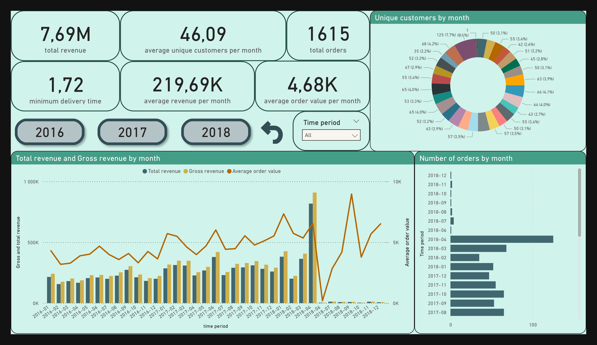
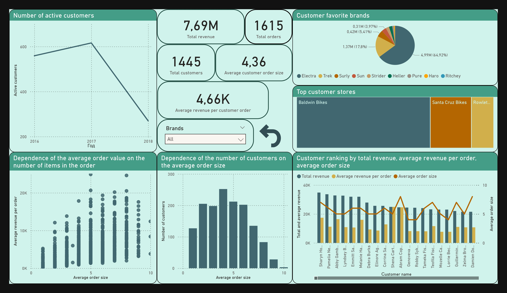
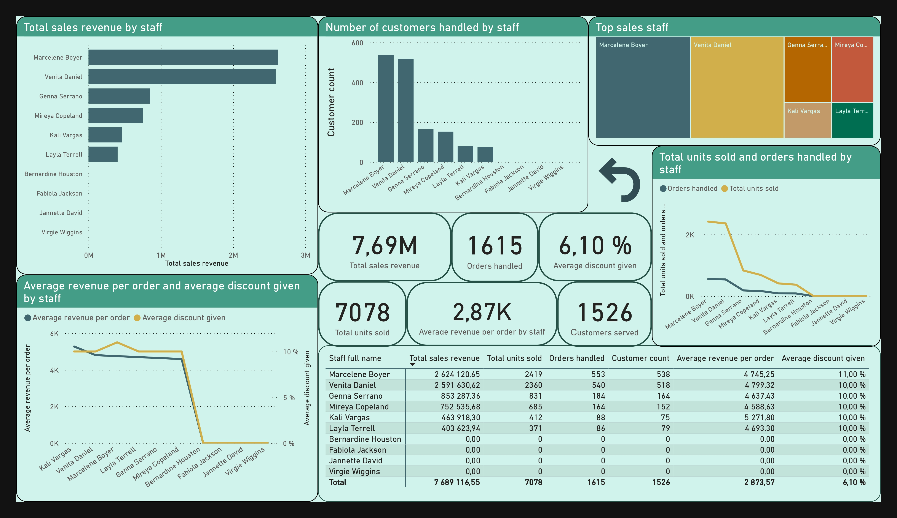
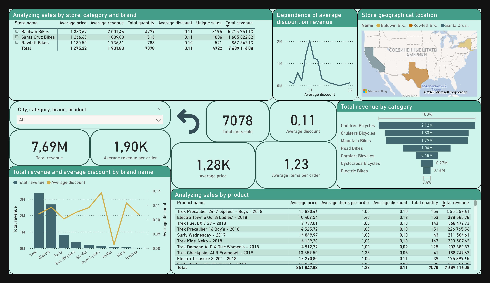

# Automated Data Pipeline for Bike Retail Chain
Demo project for skills demonstration

**About project:** This project runs the entire data cycle, transforming raw data into an analytical model and data marts for analysis using PostgreSQL and Apache Airflow. It is deployed in Docker for easy portability. Data mart is integrated with PowerBI for reporting and data exploration.

**RUN GUIDE:** 
the following scripts should be executed in the working directory

***auto***

Linux:

- ```./run_project.sh ```
  
Windows:

- ```./run_project.bat ```


***manual***
- ```echo -e "AIRFLOW_UID=$(id -u)" > .env ```
- ```sudo docker compose up airflow-init ```
- ``` sudo docker compose up ```

If everything is ok,
 
***postgresql connection:***
- adress: **localhost:5454**
- login: **admin**
- password: **123**

***airflow connection:***
- adress: **localhost:8080**
- login: **airflow**
- password: **airflow**

***dag in airflow must be started manually***

<details><summary><b>Structure:</b></summary>
 


</details>

<details><summary><b>Screenshots:</b></summary>


<center>"airflow graph"</center>



<center>"sales overviews"</center>



<center>"customer segmentation"</center>



<center>"staff perfomance"</center>



<center>"store product analysis"</center>

</details>

**Technology stack:**
- PostgreSQL
- Python
- Airflow
- PowerBI
- Docker, Docker-compose
- Linux commands
- Git
